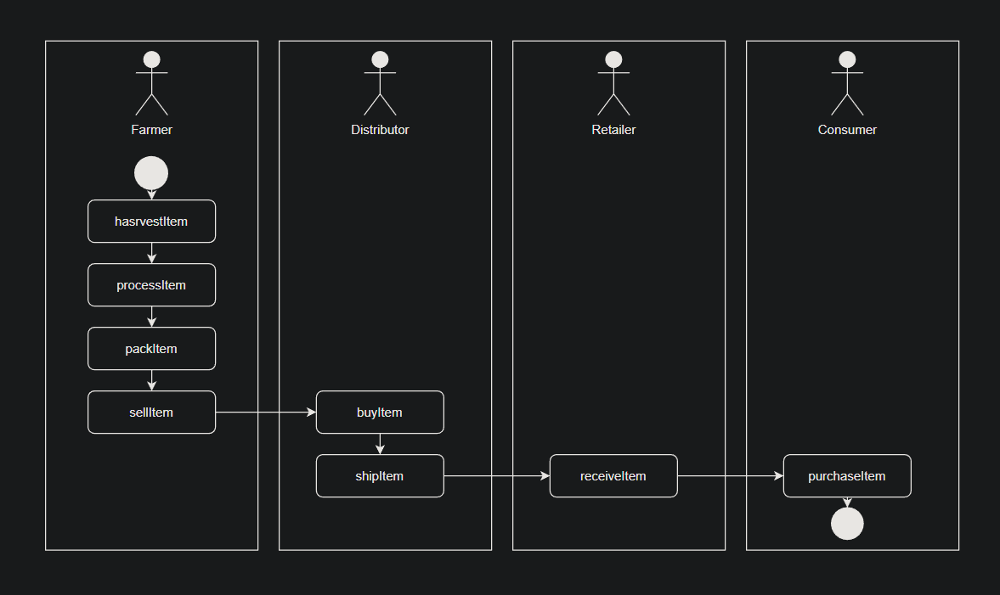
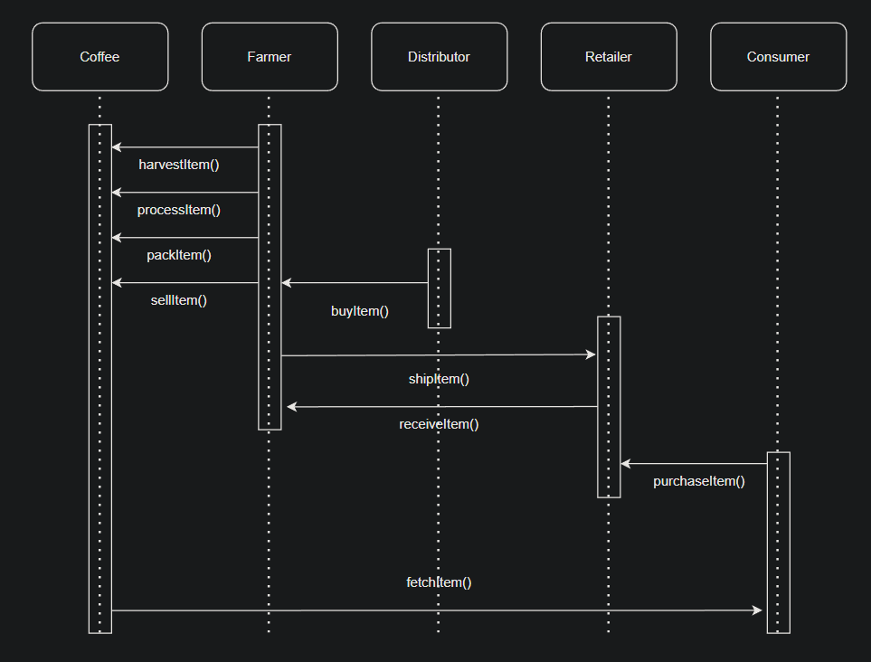
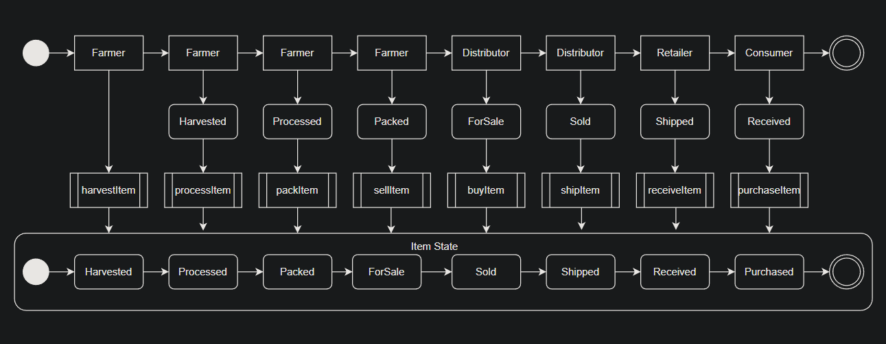
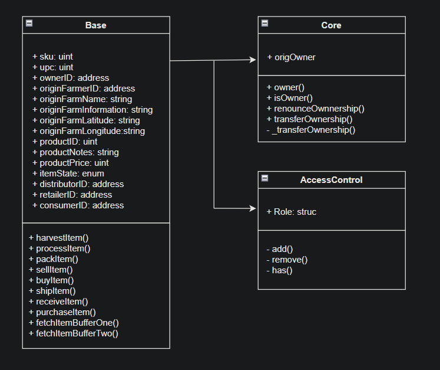
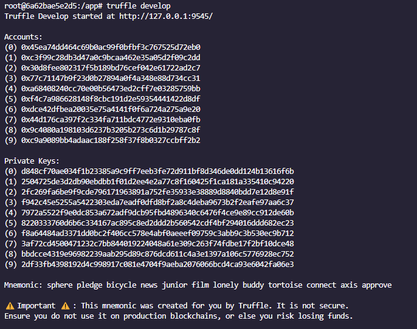
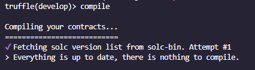
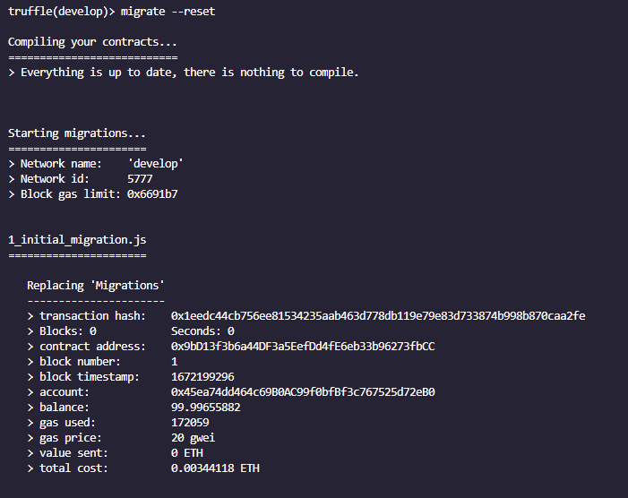
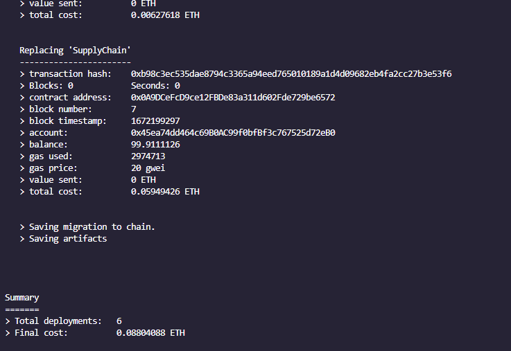

# ETH Dapp Tracking Items Through Supply Chain.

Repository to deploy an ETH DAPP that shows the flow of a coffee business through the different roles, from a Farmer to a Consumer.

-------------------------------------------------------------------------------

Actions performed by role

<table>
<thead><tr> <th>Role</th> <th>Action</th> </tr> </thead>
<tbody>
<tr> <td>Farmer</td> <td>Harvest Item   Process Item   Pack Item   Set Item For Sale</td> </tr> 
<tr> <td>Distributor</td> <td>Buy Item   Ship Item</td> </tr>
<tr> <td>Retailer</td> <td>Receive Item</td> </tr>
<tr> <td>Consumer</td> <td>Purchase Item</td> </tr>
</tbody>
</table>

## Project write-up - UMLs

### Activity Diagram

### Sequence Diagram

### State Diagram

### Class Diagram

## Project write-up - Libraries.

All of the libraries for this Dapp are specified in the Dockerfile.

<table>
<tbody>
<tr> <td>Node version</td> <td>v10.24.1</td> </tr> 
<tr> <td>Truffle version</td> <td>v5.1.13</td> </tr>
<tr> <td>Web3</td> <td>1.8.1</td> </tr>
</tbody>
</table>

# How to deploy this project using Docker?

Installing...

<code>docker build -t dapp-tracking-bc .</code>
<code>docker run -t -d -p 9545:9545 -p 3001:3001 -p 3000:3000 dapp-tracking-bc</code>

* Port 9595 is used for truffle.

* Port 3001 is for browser-sync UI.

* Port 3000 is for the dapp UI.

once the container is running you can enter the container terminal and change data like the network mnemonic or any other change in the files.

<code>docker ps</code>

<code>docker exec -it [container id] bash</code>

Once you get into the container terminal, you can follow next steps.

## Running project locally.

<blockquote>
1.- Start truffle.
</blockquote>  

<code>Truffle develop</code>

<blockquote>
2.- Compile contracts.
</blockquote>  

<code>compile</code>

 

These contracts were already compiled so you may see another message like "Compiling ./contracts/..."

<blockquote>
3.- Migrate smart contracts to the locally running blockchain.
</blockquote>  

<code>migrate --reset</code>

 
. 
. 
. 
 

<blockquote>

Deploying 'Migrations'
   ----------------------
   > block number:        8208015  
   > block timestamp:     1672120145  
   > account:             0xb9c1A59a493818B869e1e75f4F484349b313C212  
   > balance:             0.379944499236479893  
   > gas used:            157059  
   > gas price:           11 gwei  
   > value sent:          0 ETH  
   > total cost:          0.001727649 ETH  

   -------------------------------------
   > Total cost:         0.001727649 ETH

</blockquote>

<blockquote>

2_deploy_contracts.js
=====================

   Deploying 'SupplyChain'
   -----------------------
   > block number:        8208017  
   > block timestamp:     1672120160  
   > account:             0xb9c1A59a493818B869e1e75f4F484349b313C212  
   > balance:             0.348077070236479893  
   > gas used:            2869713  
   > gas price:           11 gwei  
   > value sent:          0 ETH  
   > total cost:          0.031566843 ETH  

   -------------------------------------
   > Total cost:         0.031566843 ETH

</blockquote>

<blockquote>

Summary
=======
> Total deployments:   2 
> Final cost:          0.033294492 ETH

</blockquote>

### Run the project on test network local

<code>compile</code>

<code>migrate --reset</code>

<code>test</code>

### Run the project on a test network like goerly

truffle migrate --network goerli --reset 

<code>truffle migrate --reset --network goerli</code>

Warning to deploy on the test network the cost arround "0.12 ETH"

### you can change the different port settings on browser-sync

<code>nano node_modules/browser-sync/dist/default-config.js</code>

<a href = "https://github.com/udacity/nd1309-Project-6b-Example-Template">Starter code</a>

* To use the starter code, please run <code>npm i -g truffle@4.1.14</code> to install Truffle v4 with Solidity v0.4.24.

* To check the Solidity compiler version on your local installation, you can run this command: <code>truffle version</code>.

#### Smart contracts.

* AccessControl - Collection of Contracts: These contracts manages the various addresses and constraints for operations that can be executed only by specific roles.

* Base - SupplyChain.sol: This is where we define the most fundamental code shared throughout the core functionality. This includes our main data storage, constants, and data types, plus internal functions for managing these items.

* Core - Ownable.sol: is the contract that controls ownership and transfer of ownership.

### Requirement 2: Build out AccessControl Contracts.

From the Starter Code, the files in <code>coffeeaccesscontrol</code> controls access control for each actor.

Build out these contracts so that each actor’s role in your supply chain is distinct with no overlap in their access abilities. The abilities listed for each role are exhaustive.

Example of 4 actors in a coffee supply chain are: Farmer, Distributor, Retailer, Consumer.

### Requirement 3: Build out Base Contract.

From the Starter Code, <strong>SupplyChain.sol</strong> contract holds all common structs, events and base variables.

This smart contract must implement functions that track:

* Product ID
* Product UPC
* Origination Information
* Origin Actor (e.g. Farmer ID, Farmer Name, )
* Misc. organization information (e.g. Farmer Information)
* Longitude and Latitude of Origin Coordinates (e.g. Farm’s Longitude and Latitude)
* Product notes
* Product price

### Requirement 4: Build out Core Contract

<strong>Ownable.sol</strong> is the contract that controls ownership and transfer of ownership.

This Core Contract must implement:

* Ownable - Define an owner for all the contracts.
* Secondary - Allows contract to be transferred owners.

## Part 3: Test smart contract code coverage.

### Requirement: Smart contract has associated tests.

Requirement: Smart contract has associated tests.

At minimum, test every function for every function you implemented from your Sequence Diagram. For example, from this Sequence Diagram we would need to test 10 functions:

* harvestItem()
* processItem()
* packItem()
* addItem()
* buyItem()
* shiptItem()
* receiveItem()
* purchaseItem()
* fetchItemBufferOne()
* fetchItemBufferTwo()

## Part 4: Deploy smart contracts on public test network.

Deploy your smart contract on the Ethereum RINKEBY test network.

<table>
<tr> <td>Requirement 1</td> <td>Deploy smart contract on a public test network</td> </tr>
<tr> <td>Requirement 2</td> <td>Submit Transaction hash, contract hash, and contract address</td> </tr>
</table>

### Requirement 1: Deploy smart contract on a public test network.

Deploy your smart contract with the Rinkeby test network.

Tip: Refer to Infura screencast for assistance on deploying your smart contract with Infura and Truffle.

### Requirement 2: Submit Contract Address.

Provide a document with your project submission that includes the contract address.

Document for your project must be in either ".txt" or ".md" format.

Hint: You can view the Contract address using a blockchain explorer (e.g. Etherscan).

## Part 5: Modify client code to interact with smart contract.

Create the frontend that allows your users to interact with your DApp. This should be a simple and clean frontend that manages product lifecycle as the product navigates down the supply chain.

Using javascript, create a single JS file with all web3 functions that allows your client code to interact with you smart contracts.

The coffee example in the boilerplate provides this code for you.

### Requirement: Configure client code for each actor.

Front-end is configured to:

1) Submit a product for shipment (farmer to the distributor, distributor to retailer, etc).
2) Receive product from shipment.
3) Validate the authenticity of the product.
Frontend code can be downloaded and executed from a local environment.

## Optional: Implement Infura to store product image.

Using your previous coursework experience, modify your DApp to allow the initial producer in the supply chain to upload an image of the product along with the UPC hash and store this image using Infura.

Consider including 2 methods - upload() and read()

