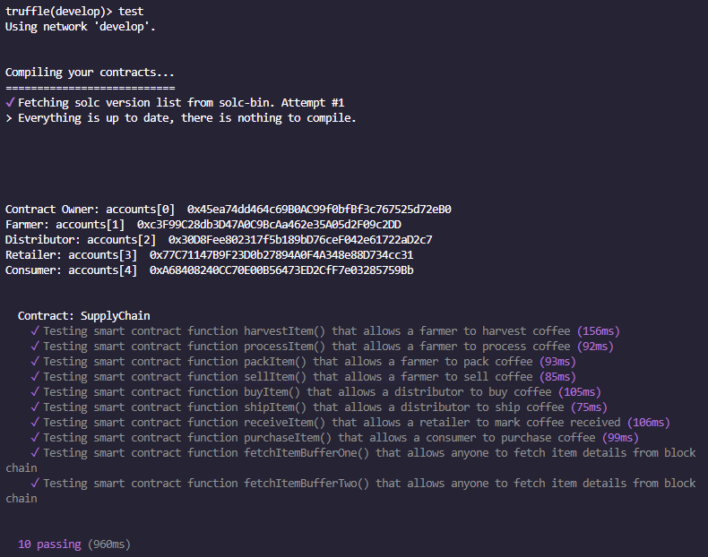
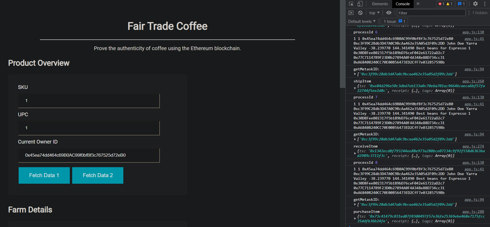
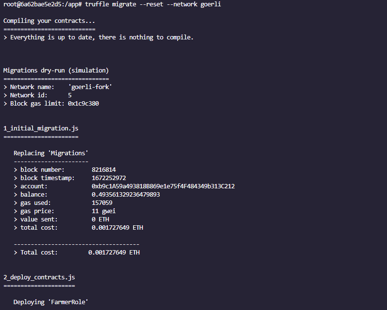
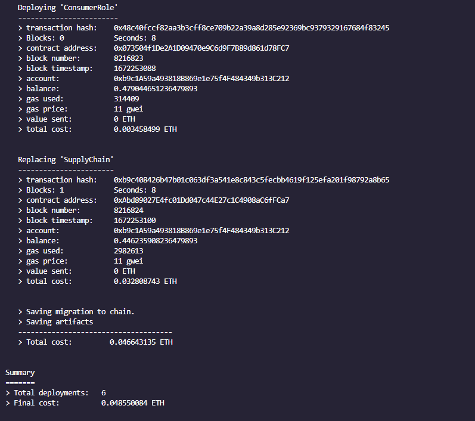

# ETH Dapp Tracking Items Through Supply Chain.

Repository to deploy an ETH DAPP that shows the flow of a coffee business through the different roles, from a Farmer to a Consumer.

-------------------------------------------------------------------------------

Actions performed by role

<table>
<thead><tr> <th>Role</th> <th>Action</th> </tr> </thead>
<tbody>
<tr> <td>Farmer</td> <td>Harvest Item   Process Item   Pack Item   Set Item For Sale</td> </tr> 
<tr> <td>Distributor</td> <td>Buy Item   Ship Item</td> </tr>
<tr> <td>Retailer</td> <td>Receive Item</td> </tr>
<tr> <td>Consumer</td> <td>Purchase Item</td> </tr>
</tbody>
</table>

## Project write-up - UMLs

### Activity Diagram

### Sequence Diagram

### State Diagram

### Class Diagram

## Project write-up - Libraries.

All of the libraries for this Dapp are specified in the Dockerfile.

<table>
<thead><tr> <th>Library</th> <th>Description</th> </tr> </thead>
<tbody>
<tr> <td>Node v10.24.1</td> <td>Cross-platform runtime environment for executing JavaScript code.</td> </tr> 
<tr> <td>Truffle v5.1.13 </td> <td>This framework allows us to generate a development / testing environment and create a pipeline for Ethereum with its different functionalities.</td> </tr>
<tr> <td>Web3 v1.8.1</td> <td>This collection of libraries allows us to interact with remote and local ETH nodes as well as other test nodes (goerly in this case). For this project, it is allowing the interaction bwtween Metamask and Infura endpoint.</td> </tr>
<tr> <td>OpenZeppelin v2.3</td> <td>OpenZeppelin Contracts helps you minimize risk by using battle-tested libraries of smart contracts for Ethereum and other blockchains. It includes the most used implementations of ERC standards.</td> </tr>
<tr> <td>Truffle hdwallet provider v1.0.17</td> <td>It allow us to sign transactions for addresses derived from a 12 or 24 word mnemonic.</td> </tr>
</tbody>
</table>

# How to deploy this project using Docker?

Installing...

<code>docker build -t dapp-tracking-bc .</code> 
<code>docker run -t -d -p 9545:9545 -p 3001:3001 -p 3000:3000 dapp-tracking-bc</code>

* Port 9595 is used for truffle.

* Port 3001 is for browser-sync UI.

* Port 3000 is for the dapp UI.

Once the container is running you can enter the container terminal and change data like the network mnemonic or any other change in the files.

<code>docker ps</code>

<code>docker exec -it [container id] bash</code>

After getting into the container terminal, you can follow next steps.

## Running project locally.

<blockquote>
1.- Start truffle.
</blockquote>  

<code>Truffle develop</code>

<blockquote>
2.- Compile contracts.
</blockquote>  

<code>compile</code>

 

These contracts were already compiled so you may see another message like "Compiling ./contracts/..."

<blockquote>
3.- Migrate smart contracts to the locally running blockchain.
</blockquote>  

<code>migrate --reset</code>

 
. 
. 
. 
 

<blockquote>
4.- Test smart contracts. 
</blockquote>  

<code>test</code>

 

<blockquote>
5.- Run the Dapp UI. 
</blockquote>  

<code>npm run dev</code>

 

### Deploying smart contract on a public test network.

In this case we are using goerly. 

First make sure you set the test network data in the config file ...

<blockquote>
truffle-config.js
</blockquote>  

To edith the file on the container

<code>nano node_modules/browser-sync/dist/default-config.js</code>

<blockquote>
const HDWallet = require('truffle-hdwallet-provider');  
const infuraKey = "test network infura key";  
const mnemonic = "metamask mnemonic";
</blockquote>  

<code>truffle migrate --reset --network goerli</code> 
or  
<code>truffle migrate --network goerli --reset </code>

 
. 
. 
. 
 

#### Contract addresses deployed.

<table>
<thead>
<tr><th>Contract Name</th><th>Contract Address</th></tr>
</thead>
<tbody>
<tr><th>FarmerRole</th><th>0x434C7225C5532bbc942639EB54d001C6fe94b74C</th></tr>
<tr><th>DistributorRole</th><th>0x588914C6546D2e12158Aeb97D66cBFC067e0965A</th></tr>
<tr><th>RetailerRole</th><th>0x1bde85263925B838172e08DaC52849502FF860A6</th></tr>
<tr><th>ConsumerRole</th><th>0x073504f1De2A1D09470e9C6d9F7B89d861d78FC7</th></tr>
<tr><th>SupplyChain</th><th>0xAbd89027E4fc01Dd047c44E27c1C4908aC6fFCa7</th></tr>
</tbody>
</table>

### you can change the different port settings on browser-sync

<code>nano node_modules/browser-sync/dist/default-config.js</code>

This is my repo juan ivan nunez baeza = juan-ivan-NV
